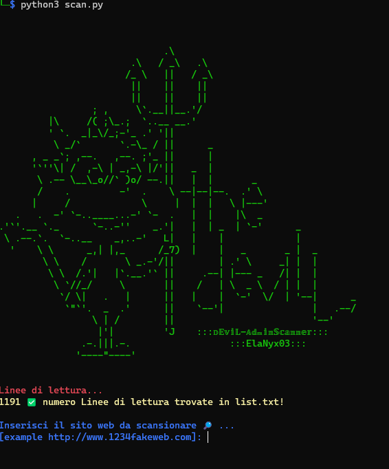
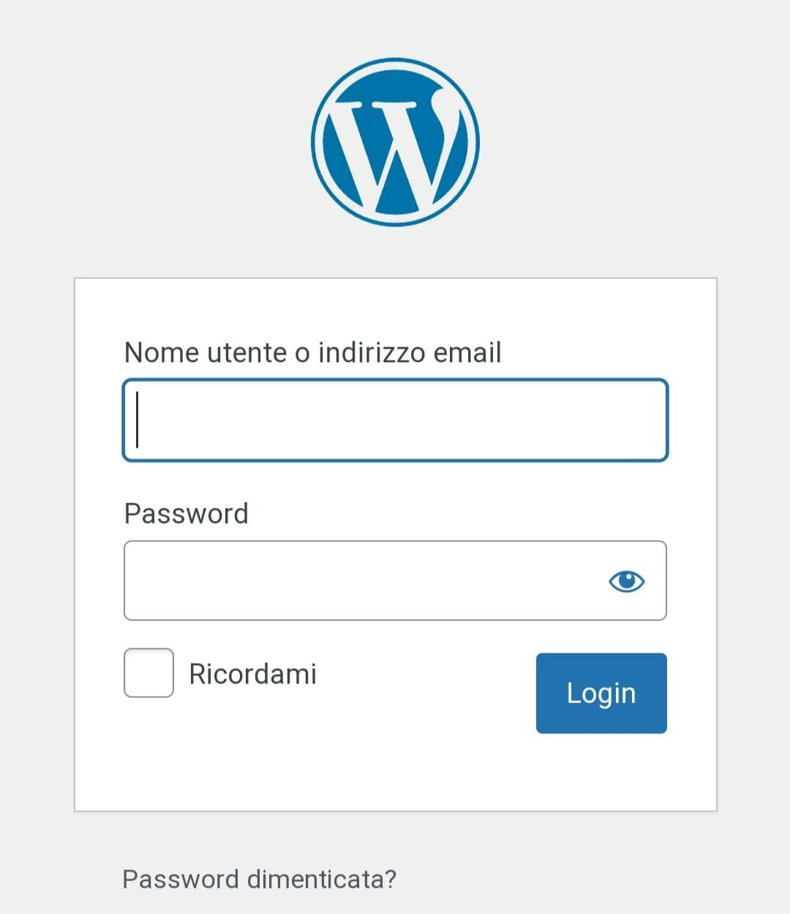

  ✰ 𝔻𝔼𝕧𝕚𝕃-𝔸𝕕𝕞𝕚𝕟𝕊𝕔𝕒𝕟𝕟𝕖𝕣 ✰🕵️‍ 
Strumento per trovare le pagine amministrative dei siti web 

  

 

  

###  ⊵ 𝕀𝕟𝕤𝕥𝕒𝕝𝕝𝕒𝕫𝕚𝕠𝕟𝕖 𝕤𝕦 (𝕃𝕚𝕟𝕦𝕩/𝕡𝕔)

    sudo apt install python3

    sudo apt install python3-pip

    sudo apt install git

    git clone https://github.com/IRYNA0308/Devil-Admin_Scanner.git

    cd Devil-Admin_Scanner

    pip3 instal -r requirement.txt

    python3 scan.py

  ⊵ 𝕀𝕟𝕤𝕥𝕒𝕝𝕝𝕒𝕫𝕚𝕠𝕟𝕖 𝕤𝕦 (𝕋𝕖𝕣𝕞𝕦𝕩/𝔸𝕟𝕕𝕣𝕠𝕚𝕕)

    pkg update && pkg upgrade

    pkg install python

    pkg install git

    git clone https://github.com/IRYNA0308/Devil-Admin_Scanner.git

    cd Devil-Admin_Scanner

    pip3 install -r requirement.txt

    python3 scan.py

  
### Disclaimer legale 

✎ L'uso di questo strumento per attaccare gli obiettivi senza il consenso reciproco è illegale. E' responsabilità dell'utente finale obbedire a tutte le leggi locali, statali e federali applicabili. Gli sviluppatori non si assumono alcuna responsabilità e non sono responsabili per qualsiasi uso improprio o danno causato da questo programma...꙳ Grazie e buon uso ꙳...

 
<h5>𝓡𝓮𝓪𝓭𝓶𝓮 𝓑𝔂 ::: ElaNyx :::</h5>
  

